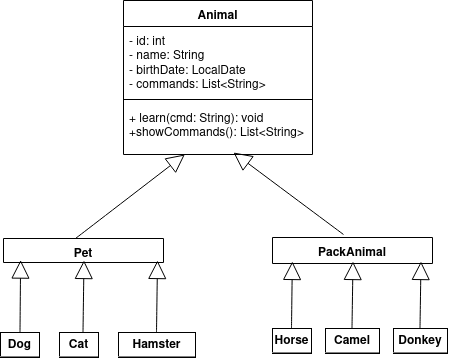

# Kennel Registry

**Описание**  
Java-приложение для учёта домашних и вьючных животных с меню (добавление, просмотр и обучение командам).  
Репозиторий содержит также дамп MySQL-базы `FriendsOfHuman`, диаграмму классов и историю терминала.

## Требования

- Java 17
- MySQL 8+
- Git (для клонирования и версионности)


## UML-диаграмма классов




## Быстрый старт

1. Клонировать репозиторий:  
   ```bash
   git clone https://github.com/ТВОЙ_ЛОГИН/kennel-registry.git
   cd kennel-registry
   ```

2. Импортировать базу данных:  
   ```bash
   mysql -u root -p FriendsOfHuman < FriendsOfHuman.sql
   ```

3. Скомпилировать Java-код:  
   ```bash
   javac Registry.java
   ```

4. Запустить программу:  
   ```bash
   java Registry
   ```

5. Работа с меню:  
   - `1` — добавить новое животное  
   - `2` — посмотреть команды животного  
   - `3` — обучить новой команде  
   - `0` — выход

## Содержимое репозитория

- `Registry.java` — исходный код Java  
- `FriendsOfHuman.sql` — дамп базы данных  
- `diagram.png` — UML-диаграмма классов  
- `history.txt` — история вводимых команд
